```{r setup, include=FALSE, message=FALSE, warning=FALSE}
library(tidyverse)
library(lme4)
knitr::opts_chunk$set(echo = FALSE, cache=FALSE)
knitr::knit_hooks$set(plot = function(x, options)  {
  paste0(knitr::hook_plot_tex(x, options), "\n\\FloatBarrier\n")
})

```


# Preliminary Analyses

This document contains preliminary analyses regarding the BAM_RAB data set as it stands. These preliminary analyses focus on the following elements: As,Cd,Cu,Fe,Pb,Se and Zn. These elements were selected based on interest in the "Big 5" contaminants of concern plus Fe due to our interest in particle formation. I also added Se given the current interests of our extended research group, as well as some interesting parallels between the behavior of Se and Zn.


## 1. Spatial-Temporal patterns in metal accumulation in stocks (mg/g).

This first set of figures represent the first stab at investigating how time and location downstream of the 6 sites investigated explain metal stocks in primary producers. In order to do so, I performed General Linear Models (GLMs) using date and site distance as predictors for variability. Predicted variable for all plots is total stocks (the sum of Epilithic, Filamentous and Epiphitic stocks) for all the BIG5+ elements.


## 1. Temporal patterns in metal accumulation in biomass contents (mg/g).


Arsenic (Fig.1) seems to be the only element that actually decreases over time as the growing season progresses. I think this would be the main suspect when we actually try to trace the relationship between metals in algae and metals in water.

```{r, echo=FALSE, fig.cap="Figure 1.1: Arsenic content of benthic biomass compartments over time.", out.width = '100%'}
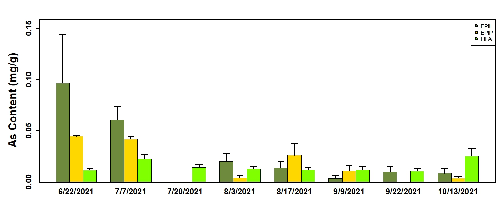
```

For most metals, patterns are pretty similar (Figs. 2,3,4,5).

```{r, echo=FALSE, fig.cap="Figure 1.2: Cadmium content of benthic biomass compartments over time.", out.width = '100%'}
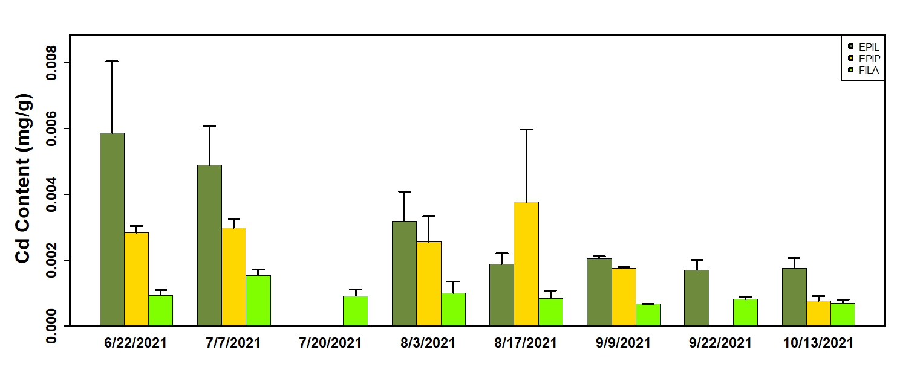
```


```{r, echo=FALSE, fig.cap="Figure 1.3: Copper content of benthic biomass compartments over time.", out.width = '100%'}
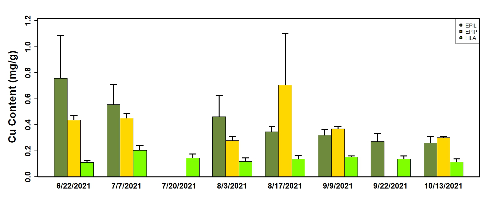
```


```{r, echo=FALSE, fig.cap="Figure 1.4: Iron content of benthic biomass compartments over time.", out.width = '100%'}
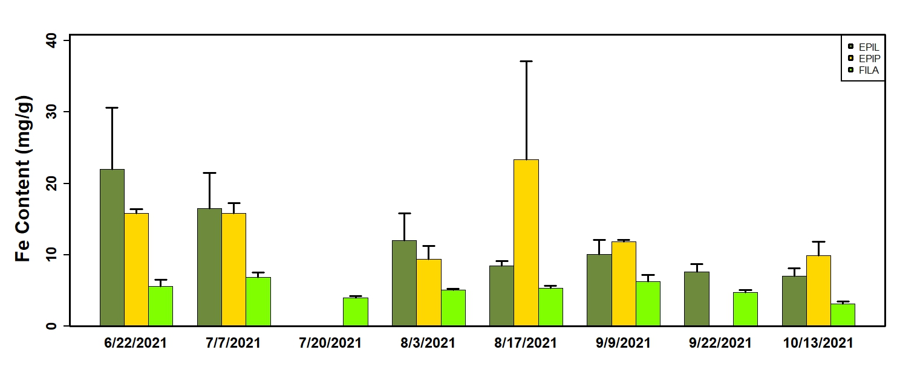
```


```{r, echo=FALSE, fig.cap="Figure 1.5: Lead content of benthic biomass compartments over time.", out.width = '100%'}
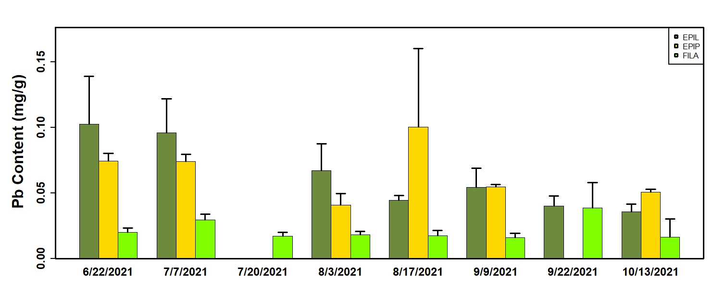
```

\newpage

Now we we get to the 2 elements that actually differ. Selenium seems to peak earlier in the season (when compared to Cd,Cu, Fe and Pb).

```{r, echo=FALSE, fig.cap="Figure 1.6: Selenium content of benthic biomass compartments over time.", out.width = '100%'}
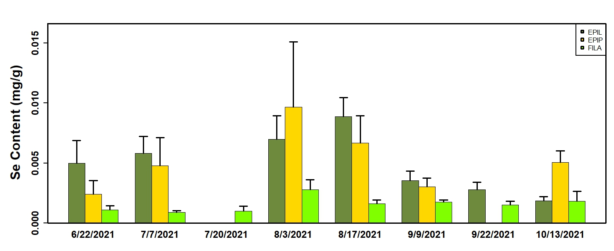
```

And of course, as discussed before, Zn is not really present in filamentous algae. Looking at the other compartments it does not seem to present any temporal trends.

```{r, echo=FALSE, fig.cap="Figure 1.7: Zinc content of benthic biomass compartments over time.", out.width = '100%'}
knitr::include_graphics("Figures/7.jpeg")
```

\newpage

## 2.Temporal patterns in metal "stocks" for individual sites.


\newpage

## Correlation between metals among compartments

\newpage

## Principal component analyses of contents and stocks by compartment.

PCA analysis was performed in a two tier fashion. Firstly, I performed a PCA analysis on all samples using the BIG5+ elements (As,Cd,Cu,Fe,Pb,Se and Zn) for both metal contents (mg/g) and stocks (mg/m2). However, due to the high collinearity (next figure, still figuring out figure numbering in Markdown) I performed a Variance Inflation test to eliminate highly collinear variables and retain the elements that comprise the highest amount of variance. I did this independently for contents and stocks.I'm calling this group of variables "LEASTVIF".


```{r, echo=FALSE, fig.cap="Correlation plots of BIG5+ elemental contents for all biomass compartments combined.", out.width = '100%'}
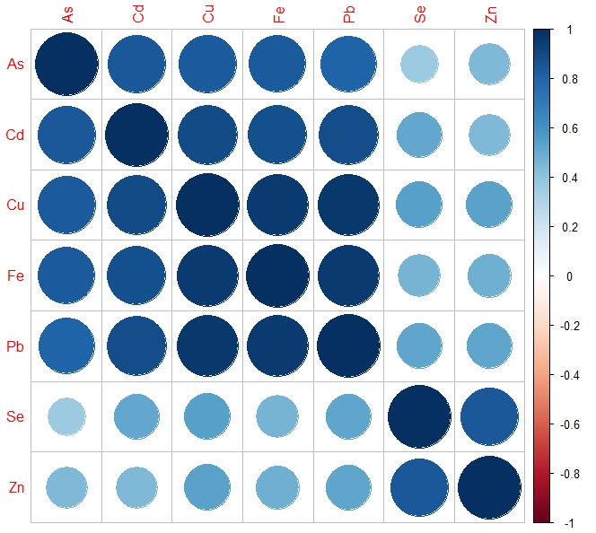
```

```{r, echo=FALSE, fig.cap="Correlation plots of BIG5+ elemental contents for all biomass compartments in separate.", out.width = '100%'}
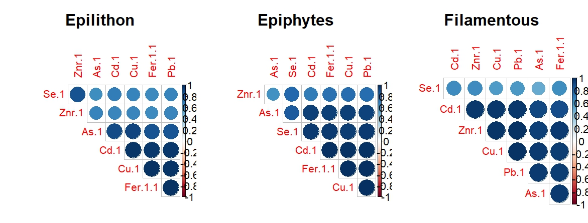
```

\newpage

These are the PCA results for contents using the BIG5+ elements. Variables have been logged, scaled and centered.

```{r, echo=FALSE, fig.cap="Prinicipal component analysis of BIG5+ elemental contents for three different biomass compartments. Secondary X and Y axes (top and right) indicate correlation between variables and principal components.", out.width = '100%'}
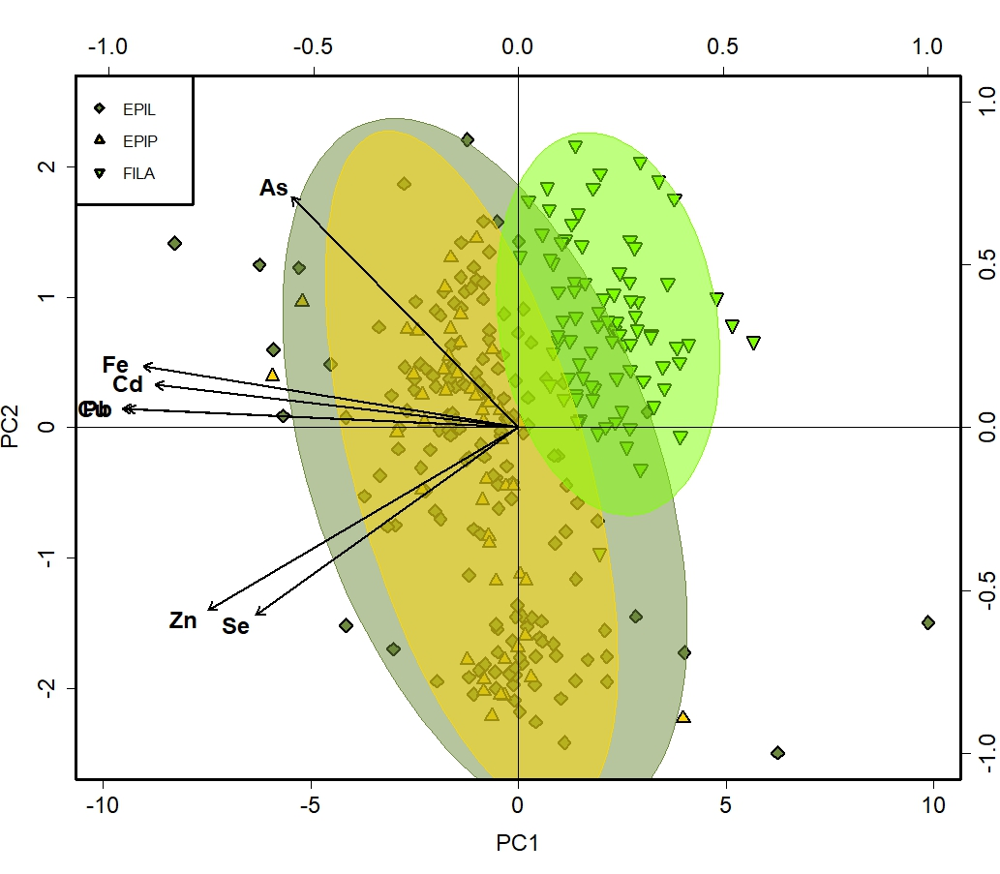
```

\newpage

Here is the correlation plot for the LEASTVIF contents dataset. Variables retained were Be,Ca,Co,Mo,Pb,S,Se,Si and Sn.

```{r, echo=FALSE, fig.cap="Correlation plots of LEASTVIF elemental contents for all biomass compartments combined.", out.width = '100%'}
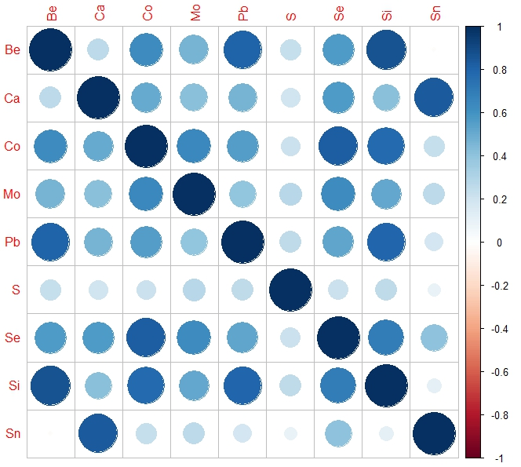
```

These are the results for contents using the LEASTVIF elements. Variables have been logged, scaled and centered.

\newpage

```{r, echo=FALSE, fig.cap="Prinicipal component analysis of LEASTVIF elemental contents for three different biomass compartments. Secondary X and Y axes (top and right) indicate correlation between variables and principal components.", out.width = '100%'}
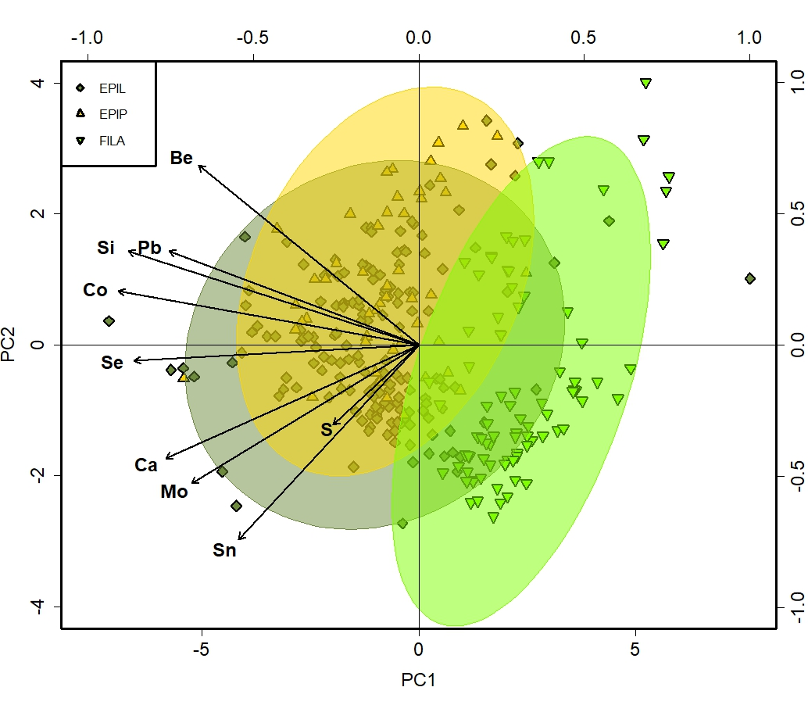
```

\newpage

Here are the results for stocks for BIG5 and LEASTVIF:

```{r, echo=FALSE, fig.cap="Prinicipal component analysis of BIG5+ elemental stocks for three different biomass compartments. Secondary X and Y axes (top and right) indicate correlation between variables and principal components.", out.width = '100%'}
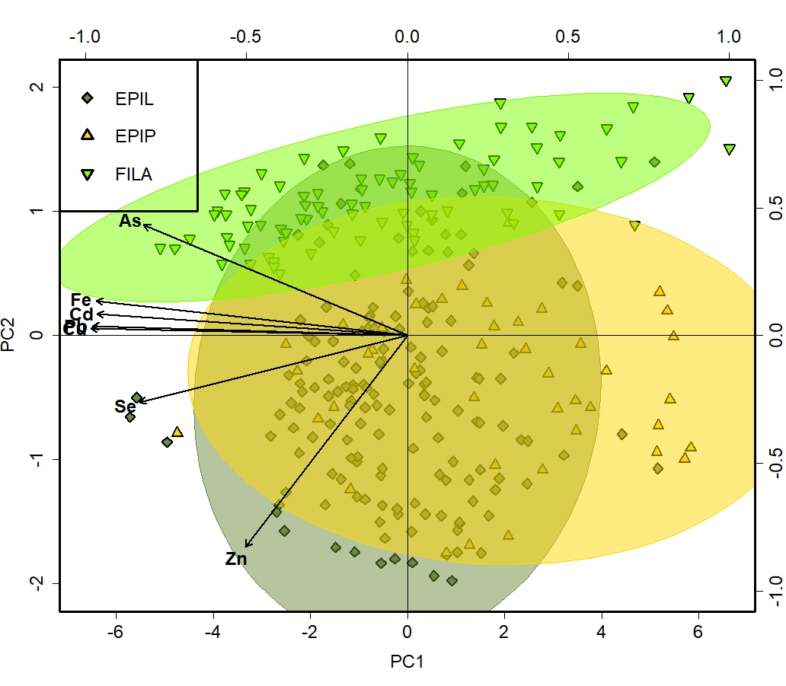
```


```{r, echo=FALSE, fig.cap="Prinicipal component analysis of LEASTVIF elemental stocks for three different biomass compartments. Secondary X and Y axes (top and right) indicate correlation between variables and principal components.", out.width = '100%'}
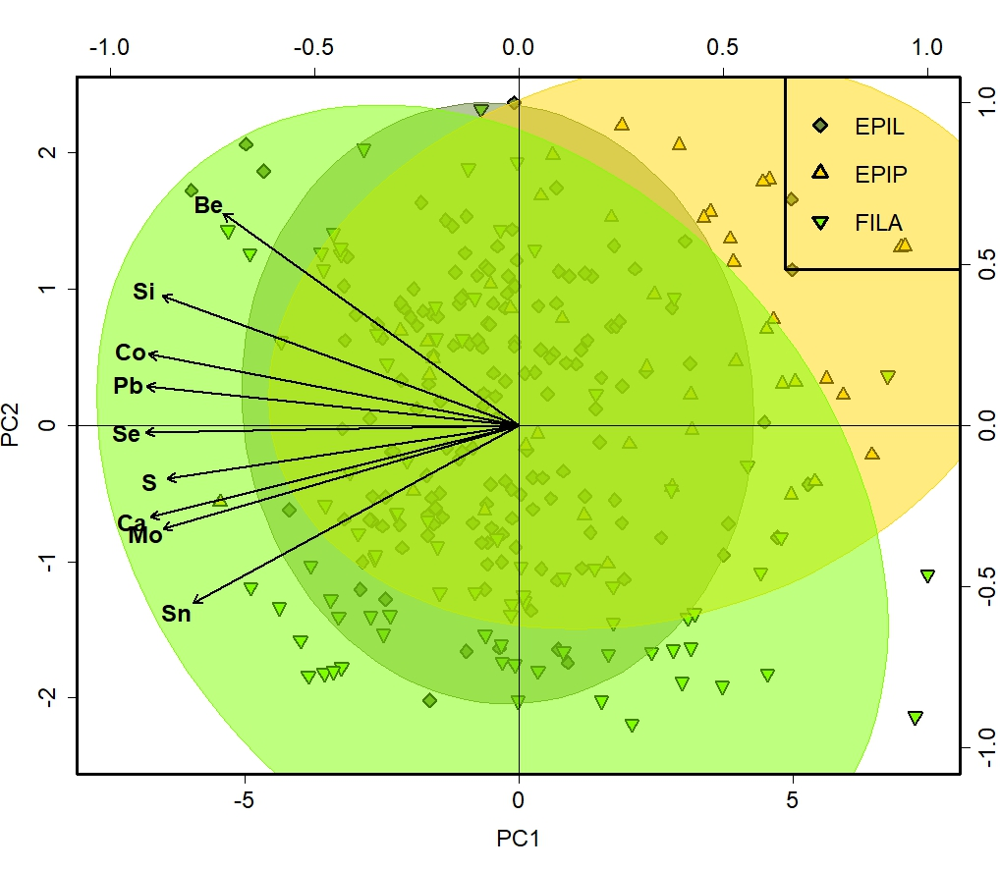
```

## Principal component analyses of contents by compartments and OM/Phycocyanin.

Following previous analyses I decided to perform individual PCAs for each compartment 


```{r, echo=FALSE, out.width="20%",out.height="20%",fig.show='hold',fig.align='center',fig.cap="tHIS STUFF. Secondary X and Y axes (top and right) indicate correlation between variables and principal components.", out.width = '100%'}
knitr::include_graphics(c("Figures/PCA_4_BIG5PLUS_EPIP_PHYCO.jpeg","Figures/PCA_4_BIG5PLUS_EPIL_PHYCO.jpeg"))
```


```{r, echo=FALSE,out.width="49%",out.height="49%",fig.show='hold',
fig.align='center', fig.cap="This is the main caption - Years 2020 - 2030 - the main caption."}
knitr::include_graphics(c("CAT.png","CAT.png"))

\newpage

Next steps are to extract PCA scores for samples and see how they vary with time. 

## Methods

##Study area

##Field Sampling

###Biomass

###Water

##Biomass sample processing

##Nutrient Analysis

##Metal Analysis

##Metabolic measurements

##Other?

# Results

##General patterns
 
Are we in a position to start thinking about these?
 
# Discussion


