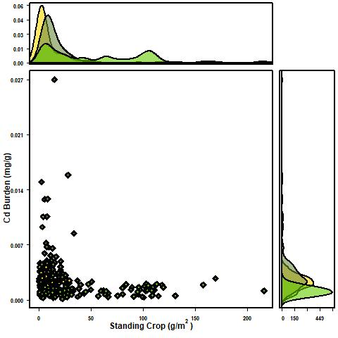

```{r setup, include=FALSE}
knitr::opts_chunk$set(echo = TRUE)
```

# Preliminary Analyses

This document contains preliminary analyses regarding the BAM_RAB data set as it stands. These preliminary analyses focus on the following elements: As,Cd,Cu,Fe,Pb,Se,Zn. These elements were selected based on interest in the "Big 5" contaminants of concern plus Fe due to our interest in particle formation. I also added Se given the current interests of our extended research group, as well as some interesting parallels between the behavior of Se and Zn.

## Spatial-Temporal patterns in metal accumulation in biomass and areal stocks.


```{r, echo=FALSE, fig.cap="A caption", out.width = '100%'}

```


```{r cars}
summary(cars)
```

## Including Plots

You can also embed plots, for example:

```{r pressure, echo=FALSE}
plot(pressure)
```


# Methods

##Study area

##Field Sampling

###Biomass

###Water

##Biomass sample processing

##Nutrient Analysis

##Metal Analysis

##Metabolic measurements

##Other?

# Results

 
# Discussion


